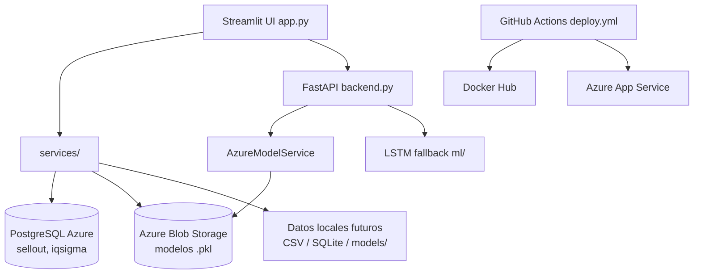

# whirpooldash

Dashboard analítico para seguimiento comercial de electrodomésticos **Whirlpool**.

## Descripción general

**whirpooldash** es un dashboard interno orientado a equipos comerciales y analíticos. Combina:

- **Streamlit** como interfaz principal (`app.py`)
- **FastAPI** como servicio auxiliar de predicción legacy (`backend.py`, puerto 8000)
- **PostgreSQL en Azure** como fuente operativa de KPIs y datos de mercado
- **Azure Blob Storage** como repositorio de modelos serializados (`.pkl`)

El repositorio conserva la arquitectura, la lógica de integración y las rutas de despliegue del proyecto original. **No incluye** datos transaccionales privados, modelos entrenados versionados ni secretos de despliegue listos para usar.

Si abres este fork en GitHub, debes asumir que la UI puede arrancar, pero las secciones que dependen de Azure o PostgreSQL **no funcionarán de forma completa** sin credenciales y datos externos válidos.

## Estado actual del proyecto

| Área | Estado | Notas |
|------|--------|-------|
| UI Streamlit | Parcial | Arranca tras instalar dependencias |
| Dashboard Performance (KPIs) | Depende de PostgreSQL Azure | Requiere tabla `sellout` y credenciales válidas |
| Dashboard Performance (gráficos) | Parcial | Algunos gráficos usan datos estáticos en `components/dashboard.py` |
| Market Performance | Depende de PostgreSQL Azure | Requiere tabla `iqsigma`; sin alternativa local hoy |
| Prediction (XGBoost) | Depende de Azure Blob Storage | Requiere tres archivos `.pkl`; tokens SAS embebidos expirados o expuestos (HTTP 403) |
| Price Calculator (FastAPI + LSTM) | Legacy | Backend importable; **no expuesto** en la navegación principal |
| CI/CD | Presente | `.github/workflows/deploy.yml` apunta a infraestructura del autor original |

**Conclusión:** el proyecto **sí es viable como base técnica** para continuar desarrollo, evaluación académica o reconstrucción controlada. **No es plenamente reproducible** con el estado actual del repositorio porque faltan datos históricos, modelos entrenados y secretos externos.

## Arquitectura

### Capas principales

| Capa | Ubicación | Rol |
|------|-----------|-----|
| Interfaz | `app.py` | Streamlit, navegación (Dashboard, Market, Prediction) y arranque de FastAPI en hilo |
| API auxiliar | `backend.py` | FastAPI: `/api/predict`, `/api/history`, `/api/partners`, etc. |
| Componentes UI | `components/` | `dashboard.py`, `market_performance.py`, `price_calculator.py`, `sku_table.py` |
| Servicios | `services/` | BD, KPIs, mercado, Azure models, XGBoost remoto, API client |
| ML | `ml/` | LSTM y procesamiento de datos (fallback sin TensorFlow) |
| Datos | `data/` | Abstracciones y mocks (FastAPI; no alimenta KPIs principales hoy) |
| CI/CD | `.github/workflows/` | Build Docker y despliegue a Azure App Service |
| Documentación | `docs/` | Auditoría técnica del repositorio |

### Flujo de datos



## Funcionalidades principales

### 1. Dashboard Performance

- KPIs de ventas, volumen y métricas comerciales por trading partner.
- Depende de la tabla PostgreSQL **`sellout`**.
- Algunos gráficos de retailers funcionan con **series estáticas** hardcodeadas, aunque los KPIs reales fallen sin base de datos.

### 2. Market Performance

- Análisis por marca, categoría y participación de mercado.
- Depende de la tabla PostgreSQL **`iqsigma`**.
- Sin credenciales válidas, la sección queda vacía o degradada.

### 3. Prediction

- Predicción de **price statements** con **XGBoost**.
- Requiere tres artefactos coordinados en Azure Blob Storage (o copias locales equivalentes):
  - `final_xgb_model.pkl`
  - `final_xgb_encoded_columns.pkl`
  - `final_xgb_source_data.pkl`
- Los tokens SAS hardcodeados en el código deben considerarse **expirados o comprometidos**.

### 4. Price Calculator (legacy)

- FastAPI + modelos LSTM por trading partner (`{partner}_model.pkl`).
- Accesible vía API en `http://localhost:8000`, pero **no integrado** como pestaña principal en la UI actual.

## Datos requeridos

Las tablas siguientes viven en PostgreSQL Azure en el entorno original. **No están incluidas en este repositorio.**

### Tabla `sellout`

| Columna | Descripción |
|---------|-------------|
| `DATE` | Fecha de la transacción |
| `TP` | Trading partner (retailer) |
| `SKU` | Código de producto |
| `QTY` | Cantidad vendida |
| `Real_price` | Precio real |
| `GROSS_SALES` | Venta bruta |
| `CATEGORY` | Categoría del producto (si aplica) |
| `BRAND` | Marca (si aplica) |
| `INFLATION` | Factor de inflación (si aplica) |
| `INV` | Inventario u otra métrica operativa (si aplica) |

### Tabla `iqsigma`

| Columna | Descripción |
|---------|-------------|
| `DATE` | Fecha de observación |
| `BRAND` | Marca |
| `CATEGORY` | Categoría |
| `SKU` | Código de producto |
| `PRICE_SOLD` | Precio de venta observado |
| `TP` | Trading partner o retailer (si aplica) |
| `REGION` | Región geográfica (si aplica) |

### Datos locales disponibles

| Recurso | Ubicación | Contenido |
|---------|-----------|-----------|
| Lista de SKUs | `unique_skus.txt` | **468 SKUs** usados en selectores y predicción |
| Logo | `assets/whirpool_logo.png` | Imagen de marca en el sidebar |

`unique_skus.txt` **no sustituye** el histórico de ventas ni de mercado. Solo provee códigos válidos para filtros y UI.

## Modelos requeridos

Los modelos **no están versionados** en Git (la carpeta `models/` está ignorada). En producción original residían en Azure Blob Storage.

| Archivo | Uso |
|---------|-----|
| `final_xgb_model.pkl` | Modelo XGBoost para la pestaña Prediction |
| `final_xgb_encoded_columns.pkl` | Columnas codificadas del pipeline |
| `final_xgb_source_data.pkl` | Dataset fuente para inferencia |
| `{partner}_model.pkl` | Modelo LSTM por trading partner (FastAPI legacy) |

Opciones para continuar:

1. Obtener copias con **autorización** del administrador Azure original.
2. **Reconstruir** modelos localmente si tienes datos de entrenamiento.
3. Implementar un **fallback demo** (reglas simples o modelo entrenado con CSV sintético).

## Variables de entorno

Crea un archivo `.env` en la raíz del proyecto. **No lo commitees.**

| Variable | Propósito |
|----------|-----------|
| `DATA_SOURCE_TYPE` | Fuente para capa FastAPI/mock (`mock` por defecto; no afecta KPIs principales hoy) |
| `DATA_MODE` | Modo operativo propuesto (`demo`, `local`, `azure`) para ruta offline reproducible |
| `POSTGRES_CONNECTION_STRING` | Conexión a PostgreSQL Azure o instancia propia |
| `LOCAL_SELLOUT_PATH` | Ruta CSV local para sellout (modo demo propuesto) |
| `LOCAL_IQSIGMA_PATH` | Ruta CSV local para iqsigma (modo demo propuesto) |
| `LOCAL_MODEL_DIR` | Directorio local de modelos `.pkl` |
| `API_BASE_URL` | URL base del FastAPI embebido |
| `API_PORT` | Puerto del backend (default `8000`) |
| `AZURE_BLOB_BASE_URL` | URL base del contenedor de modelos en Azure Blob Storage |
| `AZURE_BLOB_SAS_TOKEN` | Token SAS de lectura para blobs (usar valor propio; no reutilizar del código) |
| `PORT` | Puerto Streamlit en Docker/Azure (default `8080`) |

Ejemplo seguro (sin secretos reales):

```env
DATA_MODE=demo
POSTGRES_CONNECTION_STRING=
LOCAL_SELLOUT_PATH=data/sample_sellout.csv
LOCAL_IQSIGMA_PATH=data/sample_iqsigma.csv
LOCAL_MODEL_DIR=models
AZURE_BLOB_BASE_URL=
AZURE_BLOB_SAS_TOKEN=<REDACTED>
API_BASE_URL=http://localhost:8000
API_PORT=8000
PORT=8080
```

> **Nota:** `DATA_MODE`, `LOCAL_SELLOUT_PATH`, `LOCAL_IQSIGMA_PATH` y `LOCAL_MODEL_DIR` forman parte de la **ruta recomendada** documentada en la auditoría. Algunas aún no están implementadas en `config.py`; sirven como guía para el modo offline reproducible.

Los defaults embebidos en `config.py` y `services/run_model.py` pueden contener hosts, tokens o contraseñas placeholder. **No los uses en producción.** Sustitúyelos por variables de entorno propias.

## Instalación local

Requisitos: Python 3.11+ recomendado (alineado con `Dockerfile`).

```powershell
python -m venv .venv
.\.venv\Scripts\Activate.ps1
python -m pip install --upgrade pip
pip install -r requirements.txt
```

## Ejecución local

```powershell
streamlit run app.py
```

| Servicio | URL típica |
|----------|------------|
| Streamlit | `http://localhost:8501` |
| FastAPI (embebido) | `http://localhost:8000` |
| Documentación API | `http://localhost:8000/docs` |

Comportamiento esperado **sin credenciales Azure/PostgreSQL válidas**:

- La UI abre y la navegación funciona.
- KPIs pueden mostrarse en cero o con warnings de base de datos.
- Market Performance queda vacío o con error.
- Prediction falla con HTTP 403 al descargar blobs remotos.
- Algunos gráficos estáticos del dashboard sí se renderizan.

## Docker

Requiere Docker instalado localmente.

```powershell
docker build -t whirpooldash:local .
docker run --rm -it -p 8080:8080 -e PORT=8080 whirpooldash:local
```

Abre `http://localhost:8080`. Las mismas limitaciones de datos y modelos aplican dentro del contenedor.

## Seguridad y credenciales

- **No reutilices** secretos, tokens SAS ni connection strings del autor original.
- **No commitees** `.env`, tokens SAS, contraseñas, connection strings completas ni `azure_creds.json` con contenido real.
- Los tokens SAS embebidos en `config.py` y `services/run_model.py` deben tratarse como **expuestos o expirados**. Revócalos si tienes acceso administrativo.
- La infraestructura del autor (`joecast208/whirpooldash`, Web App `streamlit-app-demos`, resource group `st`) **no debe reutilizarse** sin autorización explícita.
- Para despliegue propio, configura **GitHub Secrets** y recursos Azure/Docker Hub bajo tu cuenta.

Documentación adicional de despliegue: `README_DEPLOY.md` (revisar y adaptar antes de usar).

## Despliegue

Existe `.github/workflows/deploy.yml`, pero **revísalo antes de activarlo**. Hoy dispara en cada push a `main` y espera secretos e infraestructura del autor:

| Secreto / variable | Uso |
|--------------------|-----|
| `AZURE_CREDENTIALS` | Service Principal JSON para Azure CLI |
| `DOCKERHUB_USERNAME` | Usuario Docker Hub |
| `DOCKERHUB_TOKEN` | Token de Docker Hub |

Valores hardcodeados en el workflow que debes cambiar en tu fork:

| Elemento | Valor actual (autor) |
|----------|----------------------|
| Imagen Docker | `joecast208/whirpooldash` |
| Web App | `streamlit-app-demos` |
| Resource Group | `st` |

**Recomendación:** desactiva el trigger automático (`on: push`) o no configures secretos hasta tener infraestructura propia. Alternativas viables: Docker local, Azure App Service propio, Render o Railway con variables de entorno.

## Ruta recomendada para continuar

Plan por fases alineado con `docs/auditoria-tecnica-whirpooldash.md`:

### Fase 0 — Seguridad y documentación

- Crear `.env.example` y mantener `.env` fuera de Git.
- Actualizar `.gitignore` (`azure_creds.json`, `models/`).
- Documentar variables y modos (`demo`, `local`, `azure`).
- No commitear secretos; usar `<REDACTED>` en documentación.

### Fase 1 — Modo offline reproducible

- Añadir `data/sample_sellout.csv` y `data/sample_iqsigma.csv` sintéticos.
- Implementar capa `DataProvider` (CSV / SQLite).
- Calcular KPIs y Market Performance desde archivos locales.
- Mostrar banner de modo demo en la UI.

### Fase 2 — Predicción aproximada

- Fallback por reglas (último precio, media móvil, inflación).
- XGBoost local entrenado con CSV demo si hay datos suficientes.
- Modelos en `models/` ignorados por Git.

### Fase 3 — Azure propio

- PostgreSQL propio (Azure, Neon, Supabase o contenedor local).
- Azure Blob Storage propio con tokens SAS rotados.
- GitHub Secrets propios y `deploy.yml` parametrizado.

## Auditoría técnica

El análisis profundo del repositorio — arquitectura, dependencias, Azure, datos, modelos, riesgos, plan de recuperación y preguntas al dueño original — está en:

**[docs/auditoria-tecnica-whirpooldash.md](docs/auditoria-tecnica-whirpooldash.md)**

Consúltalo antes de solicitar accesos al entorno Azure original o modificar el pipeline de despliegue.

## Licencia

Este proyecto está bajo la [MIT License](LICENSE) (Copyright © 2025 Joel Vargas).
